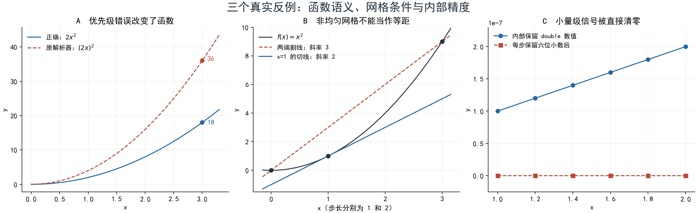

# 从真实缺陷学习数值分析

这组笔记来自 SyphonNov 的实际修复。你可以沿着“一个反例 → 为什么会错 → 数学条件 → 正确算法 → 怎么验证”的顺序学习。这里不是一本完整教材，也没有把阅读笔记记成已经掌握。

## 先做四道判断题

1. `2*x^2` 在 `x=3` 算出 36，是浮点舍入误差吗？
2. 把每一步结果保留六位小数，能否让后续计算“更准确”？
3. `x=0,1,3` 上的三个采样点，能直接套等间距中心差分吗？
4. 一条拟合线看起来经过散点，能否证明它与散点使用了同一坐标系？

如果暂时拿不准，可以直接从第一篇开始。答案都能在后面的推导和实际测试里找到。

## 建议学习路线

| 顺序 | 主题与笔记 | 你应该能够独立做到 |
| --- | --- | --- |
| 1 | [表达式与误差传播](01-表达式与误差传播.md) | 区分语义错误、绝对误差、相对误差；解释为什么差分会放大数据误差 |
| 2 | [非均匀差分与梯形积分](02-非均匀差分与梯形积分.md) | 从 Taylor 展开求三点权重；用误差比检验梯形法的二阶收敛 |
| 3 | [最小二乘与可复现计算](03-最小二乘与可复现计算.md) | 解释正规方程的条件数问题、缩放与 QR 的作用，以及固定随机种子的边界 |
| 4 | [坐标映射与图形可信度](坐标映射与图形可信度.md) | 手算数据到像素的仿射变换，用单位缩放检查图形是否失真 |
| 5 | [分辨率与矢量导出](分辨率与矢量导出.md) | 换算 mm、point、DPI 与像素；区分路径离散误差与图像分辨率 |
| 6 | [测试覆盖与数据语义](06-测试覆盖与数据语义.md) | 解释测试的量词范围；用数据往返不变量检查导入；区分保存参数与保存实验 |
| 7 | [尺度自适应与精确几何](07-尺度自适应与精确几何.md) | 用量纲分析设计容差；区分精确谓词、去重分辨率、定义域分段与静默截断 |

前置知识：函数与导数、Taylor 展开基础、矩阵乘法和线性方程组。QR 一篇会给出所需背景；若对正交投影不熟，可先完成前两篇。

## 用这套项目做练习

每次选一篇，先手算最小反例，再运行对应测试，最后改变输入尝试让方法失效。不要只记“修复后通过”：例如内点差分达到二阶，不代表端点也是二阶；Kahan 求和减少舍入误差，不会提高梯形公式的近似阶。

## 修复前后的实测对照

同一份 `test/review_regressions_test.dart` 在上游基线的 **4 个测试全部失败**，在本轮数值修复后 **4 个全部通过**。

| 反例 | 上游实际结果 | 修复后检验 |
| --- | --- | --- |
| `2*x^2`，x=3 | 36 | 18 |
| `0.0000001*x`，x=1 | 0 | 保留 `1e-7` |
| x=0,1,3 的 x²，在中间点求导 | 3 | 2 |
| 两个重复的横坐标求导 | 未报错，产生伪造的斜率 | 明确拒绝不满足条件的输入 |

完整修复状态与原始日志见 [修复记录](../修复记录.md)。图形测试还核对了 5001 行数据、非均匀 X、1e-12 的单位尺度、负值柱状图，以及真实导出内容。

上图由解析公式重建，辅助理解上表，不是软件运行截图。蓝线表示正确函数或保留精度的结果，红色虚线表示原实现的错误。可运行 `python examples/numerical_counterexamples.py` 重建（仅教学图需要 NumPy、Matplotlib）。

交叉审阅还发现了指数拟合反例：`x=[1000,1001,1002]`、`y=[1,e,e²]`。直接算 `a·exp(bx)` 会出现 `0×∞`，但中心化计算能得到正确的有限预测；详见第三篇。它说明：数学上等价的表达式，在浮点计算中可能表现完全不同。

## 自我检查卡

下次继续这个项目时，可以用以下模板记录学习，而不是重复抄结论：

- 我遇到的反例：
- 这属于哪一种错误或误差：
- 方法成立需要什么条件：
- 我能重建的关键推导：
- 我换了什么输入来检查失效边界：
- 还有哪个问题没有理解：

每篇末尾都有折叠答案。先尝试，再展开；答错时把错因写在上面的卡片里。
